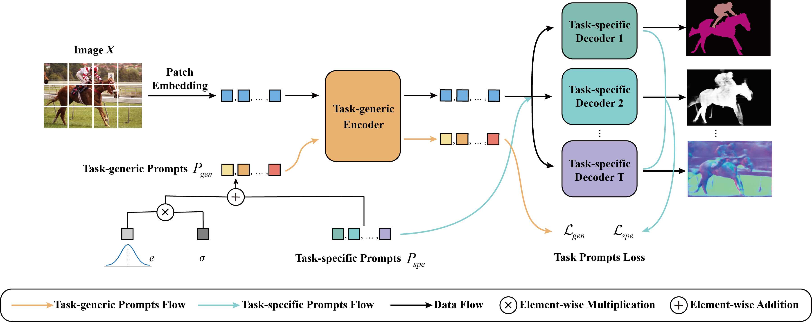

# GSPrompt-main

PyTorch implementation of "Learning Generic and Specific Prompts with Contrastive Constraints for Multi-task Visual Scene Understanding".

  

## Setup
The following dependencies are recommended for the installation of the environment.

- python 3.7.16
- torch 1.10.0
- torchvision 0.11.0

## Dataset
It is recommended to download the following datasets from the official website:

- NYUDv2: https://cs.nyu.edu/~fergus/datasets/nyu_depth_v2.html
- PASCAL-Context: https://cs.stanford.edu/~roozbeh/pascal-context/
- Cityscapes: https://www.cityscapes-dataset.com/

, and place them in the "GSPrompt-main/data/" directory.

## Training and evaluation
For training and evaluation, use the following script:

For NYUDv2:
- `bash run_gsp_nyud.sh`

For PASCAL-Context:
- `bash run_gsp_pascal.sh`

For Cityscapes:
- `bash run_gsp_cityscapes.sh`

The optimal-dataset-scale F-measure (odsF) of boundary detection is evaluated using this tools:
- Evaluation Tools: https://github.com/prismformore/Boundary-Detection-Evaluation-Tools

## Citations
If you find our work useful in your research please consider citing our paper:
'''
@article{han2025learning,
  title={Learning generic and specific prompts with contrastive constraints for multi-task visual scene understanding},
  author={Han, Tianyu and Xu, Zhimin and Li, Wanying and Hu, Haohao and He, Xinxin and He, Song and Zan, Peng and Bo, Xiaochen},
  journal={Neurocomputing},
  pages={131586},
  year={2025},
  publisher={Elsevier}
}
'''
